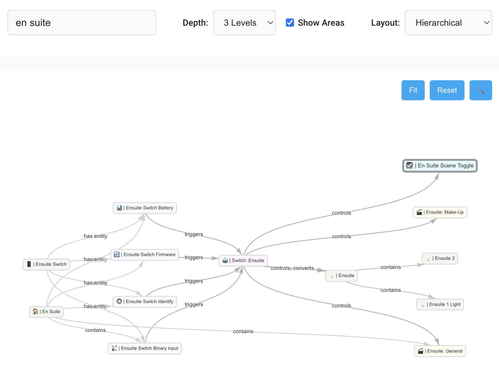
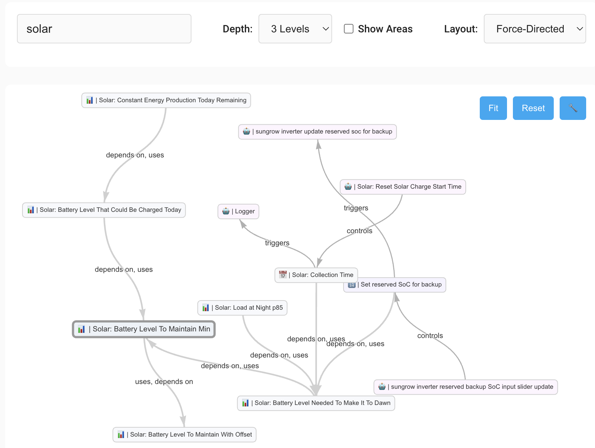

# Home Assistant Entity Visualizer

[](https://github.com/jonducrou/ha_visualiser/releases)
[](https://github.com/jonducrou/ha_visualiser/commits/main)
[](LICENSE)
[](https://github.com/hacs/integration)

A powerful Home Assistant custom integration that visualizes your smart home as an interactive graph, revealing the hidden relationships between your entities, devices, areas, automations, groups, and zones.

## 📸 Screenshots

### Interactive Network Visualization

*Visualizing relationships in an en suite bathroom setup - showing devices, entities, areas, and their connections*

### Complex Entity Relationships  

*Exploring solar system entities with templates, sensors, and automation relationships*

## ✨ Key Features

### 🎨 **Advanced Interactive Interface**
- **Clean Design**: Consistent rounded boxes with subtle light color palette
- **Entity Icons**: Visual icons for each domain (💡 lights, 🔌 switches, 🤖 automations, etc.)  
- **Focus Highlighting**: Enhanced visual feedback for the currently selected entity
- **Dual Layout Modes**: Hierarchical for simple graphs, force-directed for complex networks
- **Native HA Integration**: Single-click opens Home Assistant entity details dialogs
- **Double-Click Navigation**: Smooth, intuitive entity exploration through relationship networks

### 🔍 **Comprehensive Relationship Detection**
- **Device Relationships**: Physical device to entity mappings
- **Area & Zone Hierarchies**: Spatial organization and containment with optional filtering
- **Group Support**: Light groups, switch groups, media player groups, and traditional groups
- **Label Organization**: Home Assistant label-based groupings and classifications  
- **Automation Dependencies**: Complete trigger and control relationship chains with UUID resolution
- **Template References**: Advanced parsing for complex multi-line Jinja2 templates
- **Alert Monitoring**: Home Assistant alert entity relationships
- **Bidirectional Navigation**: True symmetrical relationship discovery and visualization

### 🚀 **Advanced Visualization**
- **Interactive Navigation**: Double-click any node to explore its neighborhood smoothly
- **2-Level Depth**: Rich context showing extended relationship networks
- **Intelligent Layout Selection**: Automatic hierarchical vs force-directed algorithm selection
- **Area Filtering**: Toggle areas on/off to simplify or expand relationship views
- **Search & Discovery**: Powerful search across entities, devices, areas, zones, groups, and labels
- **Enhanced Edge Bundling**: Clean handling of bidirectional relationships with proper grouping
- **Consistent Arrows**: Logical relationship directions (container → contained, actor → target)

### 🎯 **Smart Entity Management**
- **UUID Resolution**: Handles complex automation configurations correctly
- **Entity Type Recognition**: Supports all HA entity domains with appropriate styling
- **Real-time Updates**: Live WebSocket API integration
- **Professional Integration**: Native HA sidebar panel with authentication

## 💡 Use Cases

### **🔧 Smart Home Management**
- **Impact Analysis**: Understand which entities are connected before making changes
- **Automation Debugging**: Visualize trigger → automation → control chains
- **Device Organization**: See device-to-entity mappings and area hierarchies
- **Label Management**: Explore label-based groupings and organizational structures
- **Orphan Detection**: Identify isolated or unused entities

### **🎯 Planning & Optimization** 
- **Area Planning**: Visualize and optimize room/area organization
- **Label Strategy**: Design and refine your labeling system for better organization
- **Automation Design**: Understand existing patterns before creating new automations
- **Template Dependencies**: See which entities your templates depend on
- **System Understanding**: Get a bird's-eye view of your smart home ecosystem

### **🚨 Troubleshooting**
- **Broken Automations**: Trace automation dependencies and control flows
- **Missing Relationships**: Identify entities that should be connected but aren't
- **Complex Debugging**: Navigate multi-level entity relationships quickly

## 🚀 Installation

### **Via HACS (Recommended)**
1. Install [HACS](https://hacs.xyz/) if you haven't already
2. Add this repository to HACS as a custom repository
3. Download "Home Assistant Entity Visualizer"
4. Restart Home Assistant
5. Go to **Settings** → **Devices & Services** → **Add Integration**
6. Search for "Entity Visualizer" and add it
7. ✅ **"Entity Visualizer" now appears in your sidebar**

### **Manual Installation**
1. Copy the `custom_components/ha_visualiser/` directory to your HA `custom_components/` folder
2. Restart Home Assistant
3. Go to **Settings** → **Devices & Services** → **Add Integration**
4. Search for "Entity Visualizer" and add it
5. ✅ **"Entity Visualizer" now appears in your sidebar**

## 📖 Usage

### **Basic Navigation**
1. **Open the Panel**: Click "Entity Visualizer" in your HA sidebar
2. **Search**: Type in the search box to find entities, devices, areas, zones, or labels
3. **Entity Details**: Single-click any entity to open its native Home Assistant details dialog
4. **Navigate**: Double-click any node to explore its neighborhood relationships
5. **Explore**: Continue navigating through different areas of your smart home

### **Understanding the Visualization**
- **Nodes**: Represent entities, devices, areas, zones, labels, and automations
- **Arrows**: Show relationship directions (container → contained, label → labeled, trigger → automation → control)
- **Icons**: Visual indicators for entity types (💡🔌🤖🏠📍🏷️)
- **Colors**: Subtle color coding by domain with light, professional palette
- **Focus**: Selected entities are highlighted with enhanced borders and styling

### **Advanced Features**
- **2-Level Exploration**: See not just direct relationships but extended networks
- **Area Filtering**: "Show Areas" checkbox to toggle area relationships on/off ([detailed documentation](FILTERS.md))
- **Layout Toggle**: Switch between hierarchical and force-directed layouts for optimal visualization
- **Symmetrical Navigation**: Relationships work bidirectionally for complete context
- **Group Support**: Comprehensive support for all Home Assistant group types
- **Enhanced Template Parsing**: Support for complex multi-line Jinja2 templates with advanced regex
- **Real-time Updates**: Live reflection of changes in your HA setup

## 📋 Requirements

- **Home Assistant**: 2023.7 or later
- **Browser**: Modern web browser with JavaScript enabled
- **Network**: WebSocket support (standard in all modern browsers)

## 🏗️ Technical Details

### **Architecture**
- **Backend**: Python integration using HA's native APIs
- **Frontend**: JavaScript with vis.js for graph visualization  
- **Communication**: Real-time WebSocket API
- **Data Sources**: Entity registry, device registry, area registry, label registry, automation configs

### **Supported Relationship Types**
- **Device → Entity**: Physical device contains multiple entities
- **Area → Device/Entity**: Spatial organization and room assignments (with filtering)
- **Zone → Entity**: Geographic/proximity-based relationships
- **Label → Entity/Device/Area**: Organizational labeling and classification
- **Group → Entity**: Group containment (light groups, switch groups, media player groups)
- **Entity → Group**: Group membership relationships (bidirectional)
- **Entity → Automation**: Trigger relationships (state changes activate automations)
- **Automation → Entity**: Control relationships (automations modify entity states)
- **Template → Entity**: Dependency relationships (templates reference other entities)
- **Alert → Entity**: Alert monitoring relationships

### **Performance**
- **Lazy Loading**: Only loads neighborhoods on demand
- **Efficient Algorithms**: Optimized graph traversal and layout algorithms
- **Caching**: Smart caching of relationship data
- **Responsive**: Handles large smart home setups efficiently

## 🧪 Development & Testing

This project includes comprehensive testing infrastructure:

```bash
# Run unit tests
python tests/test_runner.py

# Validate code syntax
python tests/validate_code.py

# Test file serving
bash tests/test_file_serving.sh
```

See `/tests/README.md` for detailed testing documentation.

## 🤝 Contributing

Contributions are welcome! Please feel free to submit a Pull Request. For major changes, please open an issue first to discuss what you would like to change.

### Development Setup
1. Fork and clone the repository
2. Copy to your HA `custom_components/` directory for testing
3. Make your changes
4. Run the test suite
5. Submit a pull request

## 📝 License

This project is licensed under the Apache License 2.0 - see the [LICENSE](LICENSE) file for details.

## 🐛 Bug Reports & Feature Requests

Please use the [GitHub Issues](https://github.com/jonducrou/ha_visualiser/issues) to report bugs or request features.

## 🙏 Acknowledgments

- Built on the excellent [vis.js](https://visjs.org/) visualization library
- Inspired by the Home Assistant community's need for better entity relationship visualization
- Thanks to all contributors and users who provided feedback and testing

## 📊 Project Status

This project is actively maintained and production-ready. Current version: **0.8.10**

### Major Recent Updates

#### **v0.8.10 - "No visualisations" Error Fix** 🐛
- **🔧 Graph Loading Fix**: Fixed critical "'NoneType' object is not iterable" error preventing visualization
- **🛡️ Defensive Programming**: Added comprehensive error handling throughout graph building pipeline
- **🔄 Safe Fallbacks**: Graph service returns empty results instead of crashing on errors

#### **v0.8.9 - Critical Hotfix** 🚨
- **🔧 Boot Failure Fix**: Fixed critical issue where v0.8.8 prevented Home Assistant from starting
- **🛡️ Safe Auto-Setup**: Restored initialization safety checks while preserving automatic sidebar functionality
- **⚡ Same-Day Fix**: Immediate hotfix release with comprehensive error handling and cleanup

#### **v0.8.8 - Critical Architecture Fixes** 🔧
- **✅ Bidirectional Relationships Fixed**: Automation relationships now work properly from devices, areas, zones, labels, and scenes
- **✅ Automatic Installation**: Sidebar appears automatically after file installation - no manual setup required
- **🏗️ Architecture**: Fixed early return bugs that prevented universal relationship detection

#### **v0.8.4-0.8.7 - User Experience & Bug Fixes** 🎯
- **🖱️ Native HA Entity Dialogs (v0.8.4)**: Single-click entities to open Home Assistant details dialogs
- **🐛 Double-Click Navigation (v0.8.6)**: Fixed regression where double-click navigation stopped working  
- **🏠 Enhanced Scene Support (v0.8.5)**: Comprehensive scene entity relationship detection
- **🔗 Zone Self-Reference Fix (v0.8.7)**: Zones no longer show confusing relationships to themselves

#### **Earlier Releases**
- **✅ HACS Compliance & Scene Support (v0.8.3)**: Fixed HACS path conflicts and scene relationships
- **✅ Comprehensive Group Support**: Light groups, switch groups, media player groups
- **✅ Advanced Template Parsing**: Complex multi-line Jinja2 template support  
- **✅ Helper Entity Detection**: Change-type helpers and proxy relationships
- **✅ Enhanced Navigation**: Bidirectional relationship discovery

### Roadmap
- 🔄 Performance optimization for very large installations (>1000 entities)
- 🔄 Dashboard entity relationships
- 🔄 Custom relationship definitions
- 🔄 Saved views and layouts